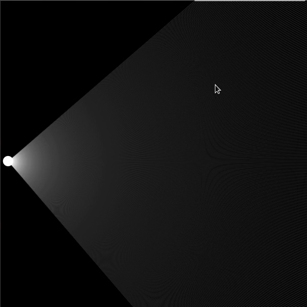

# raycasting
A simulation of a light source interacting with opaque walls. A work in progress, with many more features to be added.

## Build walls in real time!

## Occlusion
Walls are correctly occluded depending on their positions relative to the light source and other walls.

